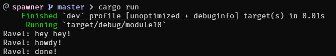

Name    : Carleano Ravelza Wongso

NPM     : 2306213022

# 1.2. Understanding how it works.

When the program runs, we observe that hey hey! is printed before howdy!, even though the code for howdy! appears first. This happens because the function responsible for printing howdy! is executed asynchronously. When the async task is spawned, it gets scheduled but doesn’t run immediately, allowing the main thread to continue and print hey hey! right away. The async task is later picked up by the executor, which first prints howdy!, waits for two seconds using a timer, and then prints done!. This sequence highlights the non-blocking nature of Rust’s async/await system, where asynchronous tasks run concurrently with the main thread without halting its progress.
